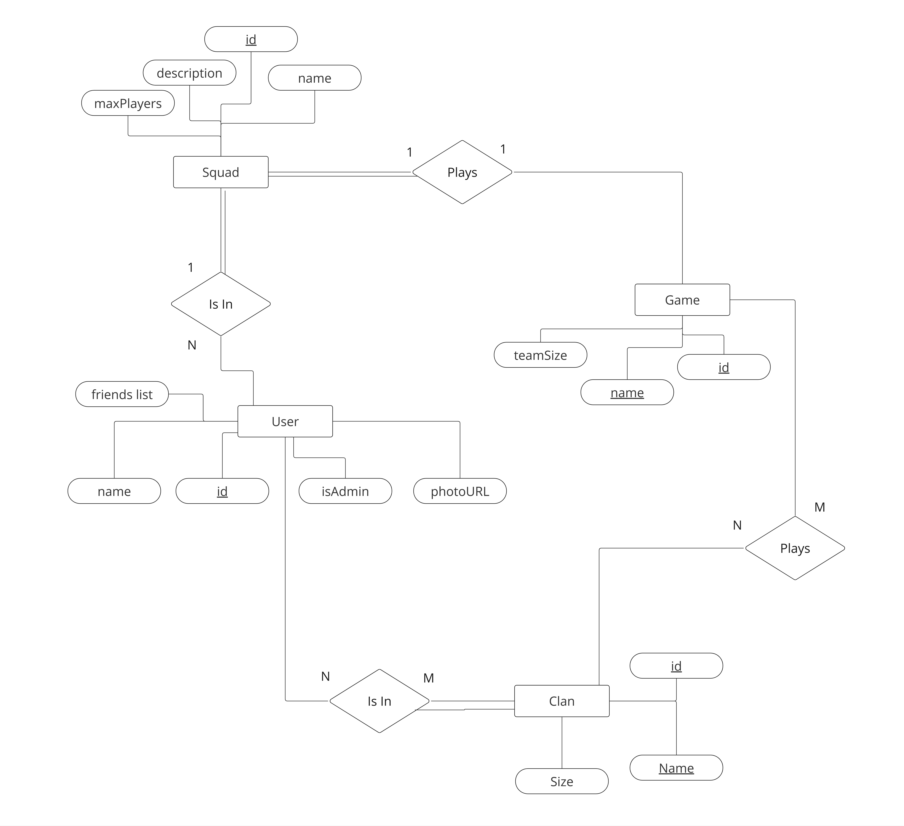
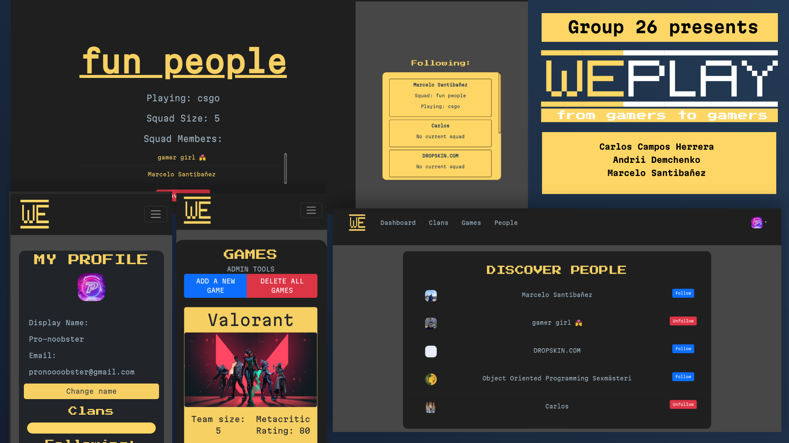

# Backend and Frontend Template

Latest version: https://git.chalmers.se/courses/dit342/group-00-web

This template refers to itself as `group-00-web`. In your project, use your group number in place of `00`.

## Project Structure

| File        | Purpose           | What you do?  |
| ------------- | ------------- | ----- |
| `server/` | Backend server code | All your server code |
| [server/README.md](server/README.md) | Everything about the server | **READ ME** carefully! |
| `client/` | Frontend client code | All your client code |
| [client/README.md](client/README.md) | Everything about the client | **READ ME** carefully! |
| [docs/DEPLOYMENT.md](docs/DEPLOYMENT.md) | Free online production deployment | Deploy your app online in production mode |
| [docs/LOCAL_DEPLOYMENT.md](docs/LOCAL_DEPLOYMENT.md) | Local production deployment | Deploy your app local in production mode |

## Requirements

The version numbers in brackets indicate the tested versions but feel free to use more recent versions.
You can also use alternative tools if you know how to configure them (e.g., Firefox instead of Chrome).

* [Git](https://git-scm.com/) (v2) => [installation instructions](https://www.atlassian.com/git/tutorials/install-git)
  * [Add your Git username and set your email](https://docs.gitlab.com/ce/gitlab-basics/start-using-git.html#add-your-git-username-and-set-your-email)
    * `git config --global user.name "YOUR_USERNAME"` => check `git config --global user.name`
    * `git config --global user.email "email@example.com"` => check `git config --global user.email`
  * > **Windows users**: We recommend to use the [Git Bash](https://www.atlassian.com/git/tutorials/git-bash) shell from your Git installation or the Bash shell from the [Windows Subsystem for Linux](https://docs.microsoft.com/en-us/windows/wsl/install-win10) to run all shell commands for this project.
* [Chalmers GitLab](https://git.chalmers.se/) => Login with your **Chalmers CID** choosing "Sign in with" **Chalmers Login**. (contact [support@chalmers.se](mailto:support@chalmers.se) if you don't have one)
  * DIT342 course group: https://git.chalmers.se/courses/dit342
  * [Setup SSH key with Gitlab](https://docs.gitlab.com/ee/ssh/)
    * Create an SSH key pair `ssh-keygen -t ed25519 -C "email@example.com"` (skip if you already have one)
    * Add your public SSH key to your Gitlab profile under https://git.chalmers.se/profile/keys
    * Make sure the email you use to commit is registered under https://git.chalmers.se/profile/emails
  * Checkout the [Backend-Frontend](https://git.chalmers.se/courses/dit342/group-00-web) template `git clone git@git.chalmers.se:courses/dit342/group-00-web.git`
* [Server Requirements](./server/README.md#Requirements)
* [Client Requirements](./client/README.md#Requirements)

## Getting started

```bash
# Clone repository
git clone git@git.chalmers.se:courses/dit342/group-00-web.git

# Change into the directory
cd group-00-web

# Setup backend
cd server && npm install
npm run dev

# Setup frontend
cd client && npm install
npm run serve
```

> Check out the detailed instructions for [backend](./server/README.md) and [frontend](./client/README.md).

## Visual Studio Code (VSCode)

Open the `server` and `client` in separate VSCode workspaces or open the combined [backend-frontend.code-workspace](./backend-frontend.code-workspace). Otherwise, workspace-specific settings don't work properly.

## System Definition (MS0)

### Purpose

The system consists of a web for players so they can find other people to play with. Players are able to create squads when they want to play a match, other players can see these squads and join them to play together. Another feature of the platform are the clans, these are so that players can build bigger communities and interact with other players.

### Pages

- Home page: Welcome message Suggested games, clans overview.
- Squads tab: Create a squad or find a squad options.
- Create a squad: Form for creating a squad.
- Find a squad: Recommended squads, filter by game, search.
- Create a clan: Form for creating a clan.
Clan page: Clan name, games played, size of the clan, members list, recent activity.
- Profile: Overview of your profile, edit function, friends.
- Game info page: Game name, game description, number of players, suggested squads.
### Entity-Relationship (ER) Diagram



The system consists of a team finder app for online games. It is aimed for players of different ages, from teenagers to adults. The system would have the most popular online games in it.

 Players register by choosing a unique username, using their email, creating a password, stating their date of birth and choosing the games that they play by marking them as favorite.

Players can join a squad, these are identified with a unique ID and will only exist if they have players in them, a player creates a squad they can define a description and a maximum size for it, the squad can only be playing one game at the time. Squads have a defined size and if there are no players in it it will be automatically deleted.

The system's games are to be previously defined by an administrator. They can add games, delete games and change the information about the games. The administrator has a name and an unique ID.

Games have a unique name, a number of players and a short description.

Players can create, join and add other players to clans. Clans will stay until they are manually deleted by players and have bigger sizes than squads. Players can also play games with their clan members instead of through a squad.

## Teaser (MS3)


